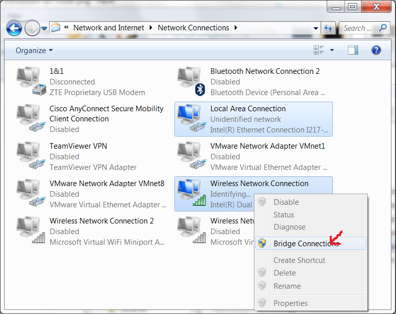
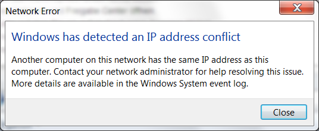
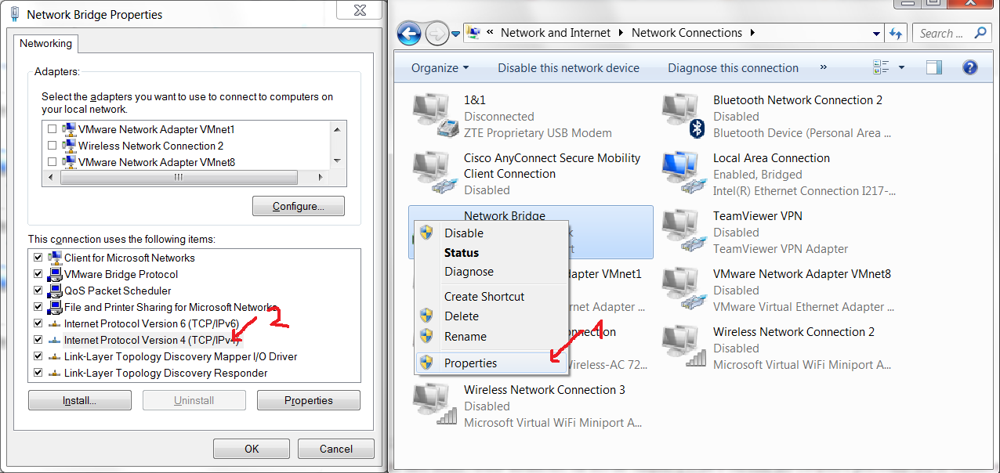
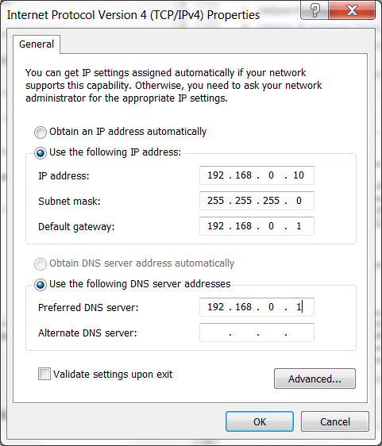

5.3 Direktverbindung mit Netzwerkbrücke
=======================================

Da Option 5.2 keinen Internetzugriff bietet aber man den Raspberry Pi nicht immer mit dem LAN-Kabel an ein Netzwerk anschließen kann, kann man über den Laptop eine Internetverbindung herstellen.

5.3.1 Netzwerkbrücke erstellen
------------------------------

Dazu muss man

1. Auf das WLAN-Symbol unten rechts klicken.
2. Das Netzwerk und Freigabe Center öffnen.
3. Links auf dem Blauen auf Verbindungen Anzeigen klicken.
4. Die Verbindungen mit der Steuerungstaste beide markieren.
5. Wie unten im Bild die Netzwerkbrücke erstellen.

Sollte dann dieses Fenster auftauchen, hat sich der Raspberry Pi die IP-Adresse des Computers geschnappt:

Wenn das Fenster nicht auftaucht, dann geht es [weiter mit der Anleitung](./README.md). Eventuell taucht es aber später auf, wenn der Raspberry Pi neu gestartet ist und dann geht es bei 5.3.2 weiter.
Wenn das Fenster nicht auftaucht, geht es [weiter mit der Anleitung](./README.md).

5.3.2 Manuelle IP-Adresse einstellen
------------------------------------

_Nebenbei: Das Fenster weist uns darauf hin, dass der Raspberry Pi die selbe IP-Adresse hat, wie unser Computer, also im Netzwerk schlecht zu unterscheiden ist. Folglich ist die Kommunikation des Raspberry Pis und dieses Rechners gestört._
Die Lösung ist, dass wir manuell eine neue Adresse eingeben, die noch niemand im Netzwerk verwendet. 

1. Netzwerbrücke löschen.
2. [Unsere IP-Adresse herausfinden](http://www.tippscout.de/windows-xp-ip-adresse-des-computers-ermitteln-und-herausfinden_tipp_2676.html), geht auch wie in 6. beschrieben. 
3. Nochmal die Netzwerkbrücke erstellen.

Danach müssen wir die IP-Adresse von der Brücke Manuell einstellen, wie unten gezeigt:

Am besten erhöhen oder erniedrigen wir die letzte Zahl der IP-Adresse etwas. Wichtig ist, dass diese Adresse noch nicht verwendet wird.

Aus `192.168.0.105` mache ich z.B. `192.168.0.10`. 
Die Gateway-IP findet man auch beim [IP-Adresse-Herausfinden (googlen)](http://www.tippscout.de/windows-xp-ip-adresse-des-computers-ermitteln-und-herausfinden_tipp_2676.html). Sie hat meistens die 1 hinten und fängt so an wie die eigene IP.

OK. OK. Und wenn das Internet noch geht, ist alles richtig.

Das Gute ist: wir wissen jetzt die IP-Adresse des Raspberry Pi und können den Schritt 6 überspringen. 

[Zurück zur Anleitung](./README.md)